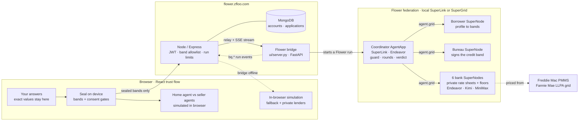

<div align="center">

# BlindQuote

**Shop every mortgage lender without becoming a lead. Your agent collects sealed, negotiated quotes from competing banks on Flower, and no bank ever sees your exact numbers.**

[](#hackathon-fit)
[](https://flower.zfloo.com)

[](https://flower.ai/)
[](#architecture)
[](https://flower.ai/)
[](https://nebius.com/)
[](#how-a-quote-is-made)


</div>

## Hackathon fit

Built at the **Flower Collaborative Agent Hackathon** (Stanford, 29 Sep 2026). The challenge was to show several Flower Agents on SuperGrid working together to do more than one agent could alone.

Mortgage shopping is a good fit because it needs several organisations that don't trust each other:

| Problem | How BlindQuote handles it |
|---|---|
| **Shopping around saves money, but turns you into a sold lead** | One extra quote saves $966–$2,086 ([Freddie Mac](https://freddiemac.gcs-web.com/news-releases/news-release-details/freddie-mac-april-2018-insight)). Congress banned mortgage "trigger leads" in the [Homebuyers Privacy Protection Act](https://www.congress.gov/bill/119th-congress/house-bill/2808). BlindQuote gets you the quotes without handing your identity to anyone. |
| **Every party holds private data** | The borrower, the credit bureau and each bank run as their own Flower **SuperNode**. The rate sheets, floors, credit files and your answers never leave their node. |
| **Banks need facts they can trust** | The bureau node signs your credit band (HMAC). Banks verify the signature, so a range still carries weight. |
| **Agents can overreach** | A code guard checks every message against an allowlist. When a bank asks for exact income, the guard blocks the request and records it in the disclosure ledger. |

**Design rule: the AI proposes, code decides.** Routing, pricing, the guard and the floors are deterministic. Models write pitches, choose a negotiation strategy and explain the result. Every model call has a timeout and a deterministic fallback.

## The demo

The customer flow is one screen with four tabs. Nothing leaves the device until the customer approves it at a gate.

1. **Your answers.** You fill in your finances and the home you want. A live panel shows *what banks will see*, always as ranges. Each field is labelled **Never sent**, **Sent as range** or **Sent as-is**, and code sets the label, not the user.
2. **Gate 1 · Seal.** Your agent seals the answers on your device. Exact values are locked, the rest become bands (DTI 36–43%, LTV 75–80%, assets $200–250k), and the bureau signs the credit band.
3. **Gate 2 · Send.** You see exactly what is released and approve it.
4. **Home.** For a home purchase, a home agent finds listings that fit your ranges and negotiates the price with each seller's agent. The seller's floor and your ceiling stay private. It then drafts the offer email to the listing agent, and you send it yourself.
5. **Gate 3 · New ranges.** The agreed price changes the loan amount, so the updated ranges go to the lenders only after you approve them.
6. **Lenders.** The six banks bid on **Flower**. Round 1 is sealed quotes. The guard blocks U.S. Bank's request for exact income and assets and flags a misleading APR. In round 2 each bank hears only its rank and its % gap to the best offer. A live ranking bar sorts every offer by total cost over the time you plan to keep the loan.
7. **Gate 4 · Accept.** Only now do your name and full application go to the winning lender, and to no one else.

The **disclosure ledger** shows what every party learned and what it never learned. Bank reviewer accounts see a one-time applicant code and ranges only. Identity stays withheld until the applicant accepts.

## Architecture



**Where the data stops.** Exact answers stay in the browser. The Node backend drops any key that is not on the band allowlist, and the coordinator checks the same allowlist again. The stay horizon goes to the coordinator for ranking and is never sent to a bank. The coordinator sees bands and quotes, but never raw data, rate sheets or floors.

## How a quote is made

| Step | What happens | Who decides |
|---|---|---|
| **Discover** | The coordinator lists the SuperNodes, and each reports its role. | code |
| **Bands** | The borrower node turns the profile into bands. Nothing else leaves it. | code |
| **Attest** | The bureau looks up the real score and returns only the band, HMAC-signed. | code |
| **Round 1** | Each bank prices from its own sheet: this week's PMMS rate + the Fannie LLPA grid + its private margin. Its model writes the pitch. | code prices, model writes |
| **Guard** | Requests for fields outside the allowlist are blocked. An APR that is off by more than 1/8 point is flagged. | code |
| **Round 2** | Each bank hears only its rank and % gap. It answers with a price ladder, and the coordinator takes the smallest rung that wins. Floors are enforced in code. | model picks strategy, code clamps |
| **Verdict** | Offers are ranked by total cost over your stay horizon (points + fees + interest). Endeavor explains the result. | code ranks, model explains |

## The agents and models

| Node | Role | Model |
|---|---|---|
| **Coordinator** (SuperLink) | Runs discovery, guard, both rounds and the verdict | Endeavor `flwrlabs/endeavor-1.0` |
| **Borrower** | Turns the private profile into bands | none (code) |
| **Pacific Credit Bureau** | Signs the credit band | none (code) |
| **Chase**, **Bank of America** | Bank SuperNodes | Endeavor (Flower) |
| **Navy Federal**, **U.S. Bank** | Bank SuperNodes. U.S. Bank is the "greedy" bank that overreaches. | Kimi-K2.7 (Nebius Token Factory) |
| **Citibank**, **Wells Fargo** | Bank SuperNodes | MiniMax-M3 (Nebius Token Factory) |

`deploy/topology.json` is the single source of truth for the nodes. Two private lenders (Harbor, Bay Area Lending Partners) have no Flower node yet, so they always run in the browser simulation, even when the banks run live on Flower.

## What is real and what is simulated

**Real:** the Flower run (SuperLink + 8 SuperNodes on a local federation), `agent.grid` messaging, the custom `bq.*` events streamed through Flower's run-event stream to the UI, the Endeavor, Kimi and MiniMax model calls, the guard, the HMAC bureau signature, the PMMS and LLPA pricing inputs, and the JWT accounts in MongoDB.

**Synthetic or simulated:** the banks, borrower and bureau data (`nodes/`); the home listings and seller-agent negotiation (browser); the two private lenders (browser). When the bridge is offline, the Lenders tab falls back to an in-browser simulation and labels it *Simulated in your browser (Flower bridge offline)*.

**Not yet run:** SuperGrid. `deploy/compose.supergrid.yaml` is generated from the same topology but needs SuperNode registration on the event account.

## Run it

Requirements: `uv` (Python 3.12, flwr 1.39.0), Node 20+, MongoDB, and a root `.env` from `.env.example` (`FLWR_MODEL_API_KEY`, the Nebius keys, `BUREAU_HMAC_KEY`).

```sh
# 1 · Flower engine
uv sync && cp -n .env.example .env
uv run python scripts/gen_nodes.py                 # synthetic node data + secrets/bureau.key
uv run pytest -q                                   # offline tests, no models
uv run python deploy/local_federation.py up        # SuperLink + 8 SuperNodes on 127.0.0.1
BQ_MODE=local uv run uvicorn ui.server:app --port 8765

# 2 · Backend (MONGODB_URI, JWT_SECRET, FLOWER_BRIDGE_URL=http://127.0.0.1:8765 in backend/.env)
cd backend && npm install && npm run dev           # http://localhost:4000

# 3 · Frontend
cd frontend && npm install && npm run dev          # http://localhost:5173, proxies /api to :4000
```

In the app, open a new application, click **Sample data**, then seal and approve. The Lenders tab shows **Live on Flower** with the SuperNode count.

Other ways to run the engine:

- **Engine UI:** `uv run uvicorn ui.server:app --port 8765` and open it. It has four modes: Replay (a recorded real run, no network), Simulation (in-process, real models), Local Flower and SuperGrid.
- **CLI:** `uv run python -m sim.run` (add `--no-llm` for offline, `--record <file>` to save a replay).
- **Flower Chat:** `cd blindquote && uv run flwr chat`, then `/federation @<account>/<federation>` and `/load .`.
- **Flower Hub:** `cd blindquote && uv run flwr build && uv run flwr app publish .`

## Deployment

Live at **https://flower.zfloo.com**. nginx serves the Vite build and proxies `/api/` to the Node backend on port 4000. Two systemd units add Flower: `flower-bq-federation` (SuperLink + SuperNodes) and `flower-bq-bridge` (port 8765). Both run as an unprivileged `flower` user and bind to `127.0.0.1` only. The steps are in [docs/deploy-flower.md](docs/deploy-flower.md).

For SuperGrid instead of the local federation, set `BQ_MODE=supergrid` and `BQ_FEDERATION=@<account>/<federation>`, then run `uv run python deploy/gen_supergrid.py`.

## API

All routes except auth and health need `Authorization: Bearer <token>`.

| Method | Path | Description |
|---|---|---|
| POST | `/api/auth/register` | Create an account (`role`: `customer` or `bank`) |
| POST | `/api/auth/login` | Log in, returns a JWT |
| GET / PUT | `/api/auth/me` | Current user; update name, profile sections, settings |
| POST | `/api/auth/password` | Change password |
| POST | `/api/applications` | Submit an application (customer) |
| GET | `/api/applications` | Own applications (bank: all, redacted) |
| GET | `/api/applications/:id` | Application detail with the agent conversation |
| POST | `/api/applications/:id/decision` | Final approve or deny (bank) |
| POST | `/api/applications/:id/renegotiate` | Re-run the agent negotiation (customer) |
| GET | `/api/flower/status` | Whether the Flower federation is up |
| POST / GET | `/api/flower/*` | Start a Flower run from sealed bands and stream its events |
| GET | `/api/health` | Health check |

## Repository

```text
frontend/            React + Vite: trust flow (answers → seal → home → lenders), accounts, bank screens
backend/             Node + Express: JWT auth, applications, /api/flower relay, bands.js
blindquote/          the Flower AgentApp (Hub-publishable); core/ is transport-agnostic, flower_grid.py binds it
nodes/               synthetic private data per SuperNode (never in the FAB)
deploy/              topology.json, local federation launcher, SuperGrid compose generator, systemd units
ui/                  FastAPI bridge + standalone engine UI
sim/                 in-process federation and CLI
tests/               offline engine tests (pytest)
docs/                engine, event schema, deploy guide, trust-flow plan, hackathon brief, research
```

Engine details: [docs/blindquote-engine.md](docs/blindquote-engine.md). Event contract: [docs/event-schema.md](docs/event-schema.md).

## Honest limits

- These are pre-qualification quotes, not binding Loan Estimates.
- HMAC with a consortium key stands in for bureau-grade signatures. Ed25519 or verifiable credentials are the upgrade path.
- Loans are priced at the band midpoint.
- The pricing inputs (PMMS, LLPA) are real. The banks, borrower, bureau and listings are synthetic.

## Team

Built by **Charlie Gillet**, **Philip Mocanu** and **Johnny Fan**, with Claude Code agents for implementation and review.
